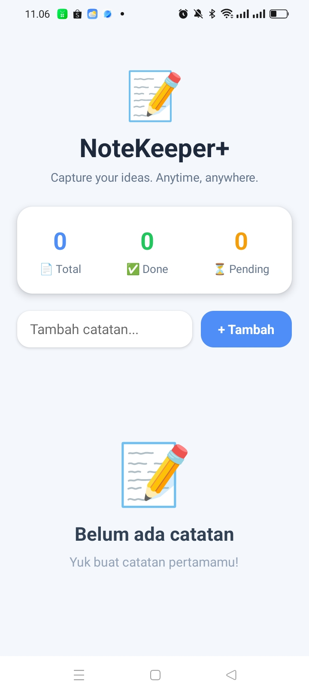
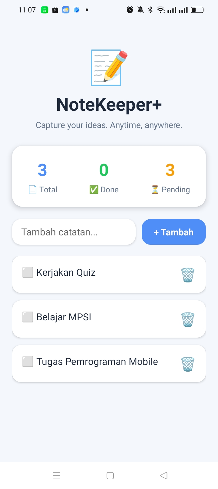
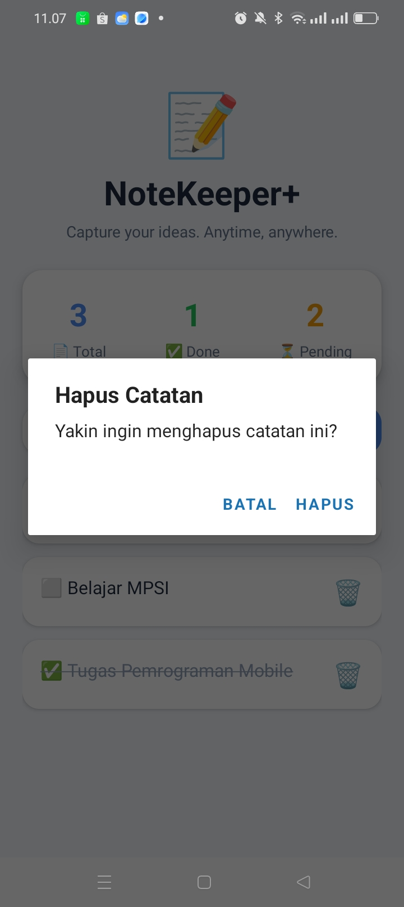
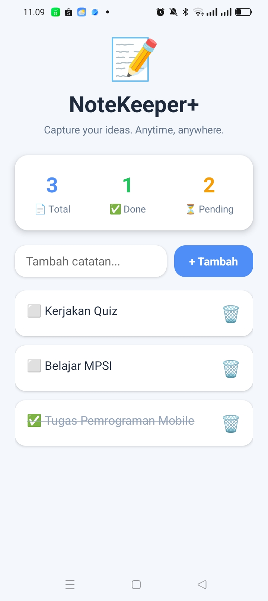

# 📝 NoteKeeper+

NoteKeeper+ adalah aplikasi pencatat sederhana berbasis **React Native** yang dibangun menggunakan **Expo** dan **AsyncStorage**. Aplikasi ini memungkinkan pengguna untuk menambahkan, melihat, memperbarui, dan menghapus catatan. Seluruh data disimpan secara lokal sehingga tetap tersedia meskipun aplikasi ditutup dan dibuka kembali.

---

# ✨ Fitur

## ✅ Level 1 (Core)

- Create (Menambah catatan)
- Read (Menampilkan catatan saat aplikasi dibuka)
- Delete (Menghapus catatan)
- Menyimpan data menggunakan AsyncStorage
- FlatList untuk menampilkan daftar catatan
- Empty State ketika belum ada data

## ⭐ Level 2 (Dipilih)

- ✅ Update (Toggle status selesai)
- ✅ Statistik Catatan (Total, Done, Pending)
- ✅ Konfirmasi sebelum menghapus catatan

---

# 📱 Screenshot Aplikasi

## 1. Empty State

Tampilan awal aplikasi ketika belum terdapat catatan.



---

## 2. Daftar Catatan

Pengguna berhasil menambahkan beberapa catatan dan statistik diperbarui secara otomatis.



---

## 3. Konfirmasi Hapus

Dialog konfirmasi ditampilkan sebelum catatan dihapus.



---

## 4. Bukti Persistensi

Data tetap tersimpan setelah aplikasi ditutup dan dibuka kembali menggunakan AsyncStorage.



---

# 🚀 Cara Menjalankan Aplikasi

1. Clone repository

```bash
git clone https://github.com/Joyyy216/note-keeper.git
```

2. Masuk ke folder project

```bash
cd note-keeper
```

3. Install dependency

```bash
npm install
```

4. Install AsyncStorage

```bash
npx expo install @react-native-async-storage/async-storage
```

5. Jalankan aplikasi

```bash
npx expo start
```

6. Scan QR Code menggunakan aplikasi **Expo Go**.

---

# 🛠 Tech Stack

- React Native
- Expo SDK 54
- JavaScript
- AsyncStorage
- React Hooks (useState & useEffect)
- FlatList

---

# 💾 Penyimpanan Data

Aplikasi menggunakan **AsyncStorage** untuk menyimpan data catatan secara lokal sehingga data tetap tersedia setelah aplikasi ditutup dan dibuka kembali.

---

# 🔗 Expo Snack

https://snack.expo.dev/@joyyy21/notekeeper

> Ganti dengan link Expo Snack milikmu.

